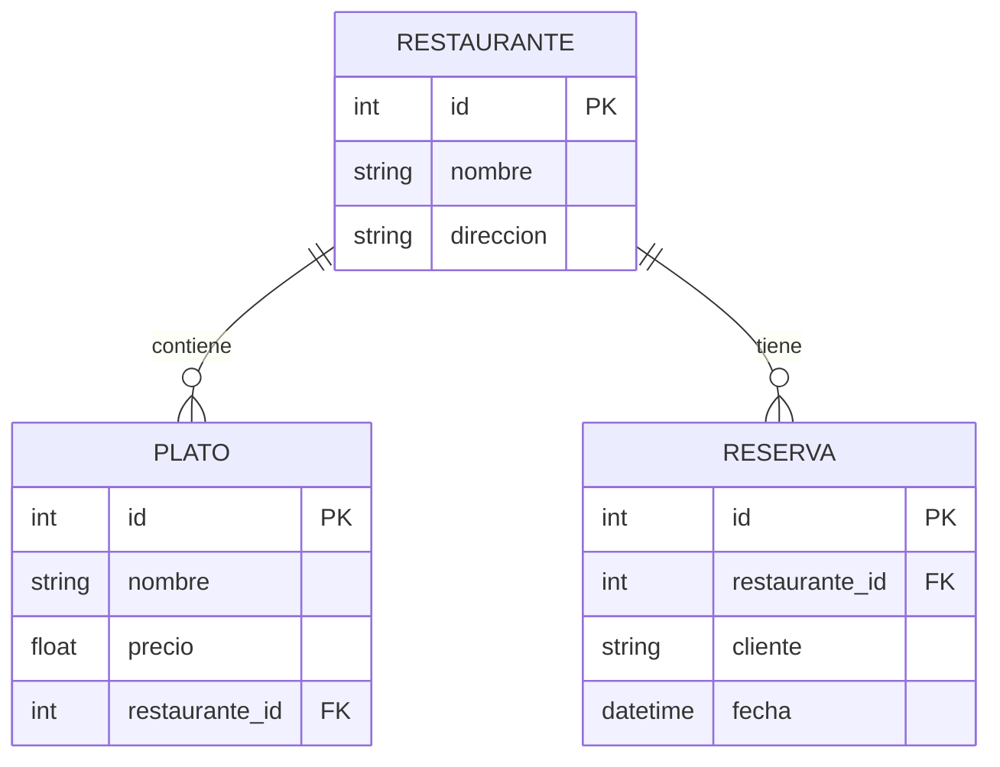

# Base de Datos

**Nota (Nov 2025)**: Cambios recientes: `scripts/init_db.py` se hizo idempotente para evitar duplicados de restaurantes al reiniciar el stack. Se añadió `scripts/cleanup_duplicates.py` para detectar y consolidar duplicados en caso necesario. Ejecutar siempre un backup antes de aplicar `--apply` en el script de limpieza. Más información en `docs/AUDITORIA.md`.

## Resumen
PostgreSQL central (actualmente compartida) y MongoDB para autenticación.

## Diagrama ER Simplificado

## MongoDB (Auth)
Colecciones:
- users
- refresh_tokens

## Inicialización
`/scripts/init_db.py` crea tablas y datos de prueba. Nota: la versión actual es idempotente y usa constraints/ON CONFLICT para evitar duplicados; los cambios en esquema deben versionarse como migraciones para entornos staging/production.
