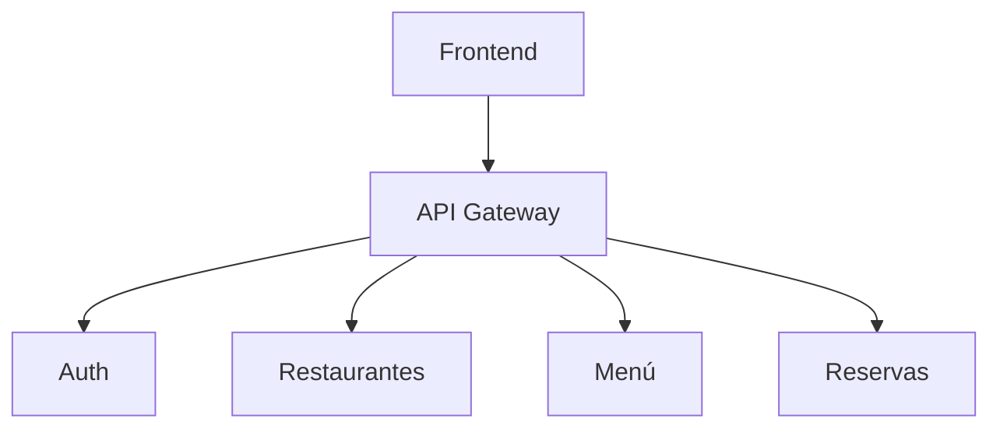

# API Gateway

**Nota (Nov 2025)**: Cambios recientes: el script de init de la BD (`scripts/init_db.py`) es ahora idempotente para evitar duplicados de restaurantes en reinicios. Si existen duplicados históricos, usar `scripts/cleanup_duplicates.py` en dry-run y aplicar con `--apply` tras backup. Más detalles en `docs/AUDITORIA.md`.

## Funcionalidad
- Reenvío de métodos: GET, POST, PUT, PATCH, DELETE.
- Propagación de cabeceras, incluyendo Authorization.
- Timeout configurable mediante `GATEWAY_TIMEOUT` (por defecto 5s).

## Diagrama

## Mejoras Futuras
- Middleware de autenticación.
- Retries y circuito de ruptura.
- Logging estructurado.
