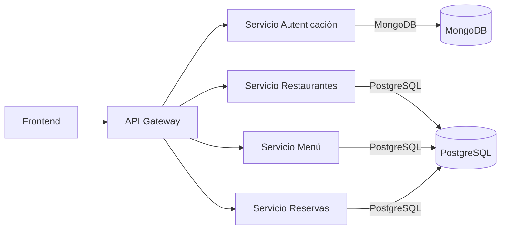

# Sistema de Reservas de Restaurantes

**Nota (Nov 2025)**: Cambios recientes: `scripts/init_db.py` ahora es idempotente para evitar la creación de restaurantes duplicados en reinicios; se añadió `scripts/cleanup_duplicates.py` para detectar y consolidar duplicados (ejecutar dry-run antes de aplicar). Hacer backup antes de `--apply`. Ver `docs/AUDITORIA.md` para más información.

Bienvenido a la documentación oficial del sistema de microservicios para la gestión de restaurantes, menús y reservas.

## Objetivos
- Centralizar información técnica.
- Facilitar onboarding de nuevos desarrolladores.
- Definir claramente contratos de API y arquitectura.

## Vista Rápida de la Arquitectura

## Tecnologías Principales
- Python / FastAPI
- PostgreSQL & MongoDB
- Docker & Docker Compose
- JWT (Autenticación)
- MkDocs Material (Documentación)

## Estado Actual
Consultar la sección de Auditoría para progreso detallado.
