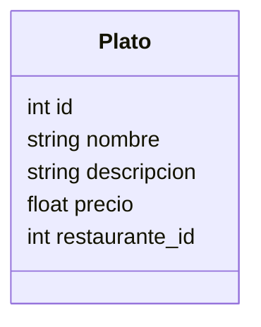

# Servicio de Menú

**Nota (Nov 2025)**: Cambios recientes: el init de la base de datos es idempotente (`scripts/init_db.py`) y se añadió `scripts/cleanup_duplicates.py` para consolidar restaurantes duplicados si existen. Ejecutar backup antes de aplicar cualquier limpieza.

## Endpoints
- GET /platos/
- GET /platos/{id}
- POST /platos/
- PUT /platos/{id}
- DELETE /platos/{id}

## Modelo Plato

## Mejoras Futuras
- Menú del día.
- Filtros por categoría.
