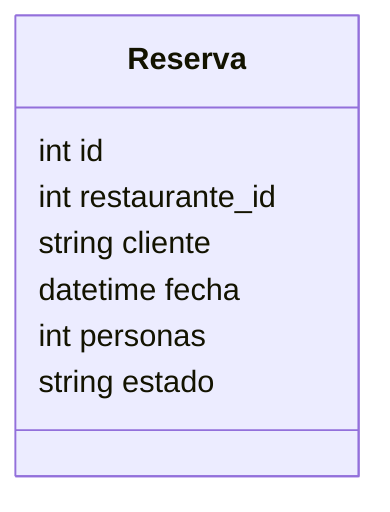

# Servicio de Reservas

**Nota (Nov 2025)**: Cambios recientes: la inicialización de la base (`scripts/init_db.py`) es idempotente para evitar duplicados de restaurantes. Si se detectan duplicados históricos, usar `scripts/cleanup_duplicates.py` en dry-run y aplicar con `--apply` tras backup. Más información en `docs/AUDITORIA.md`.

## Endpoints
- GET /reservas/
- GET /reservas/{id}
- POST /reservas/
- PUT /reservas/{id}
- DELETE /reservas/{id}
- PUT /reservas/{id}/estado

## Reglas
- No se permiten fechas en el pasado.
- Validación de disponibilidad por franja horaria.

## Modelo Reserva

