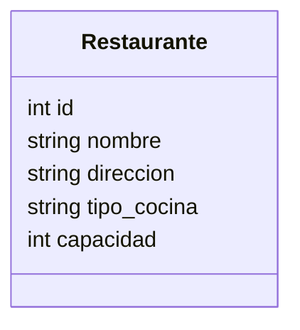

# Servicio de Restaurantes

**Nota (Nov 2025)**: Cambios recientes: el script de inicialización (`scripts/init_db.py`) fue actualizado para ser idempotente y evitar la creación reiterada de restaurantes al reiniciar. Si existen duplicados previos, usar `scripts/cleanup_duplicates.py` con `--apply` tras revisar el dry-run y realizar backup. Consulte `docs/AUDITORIA.md` para procedimiento y recomendaciones.

## Endpoints Principales
- GET /restaurantes/
- GET /restaurantes/{id}
- POST /restaurantes/
- PUT /restaurantes/{id}
- DELETE /restaurantes/{id}

## Modelo SQL (resumen)

## Notas
- Validaciones básicas de datos.
- Docker expone el puerto 8001.
