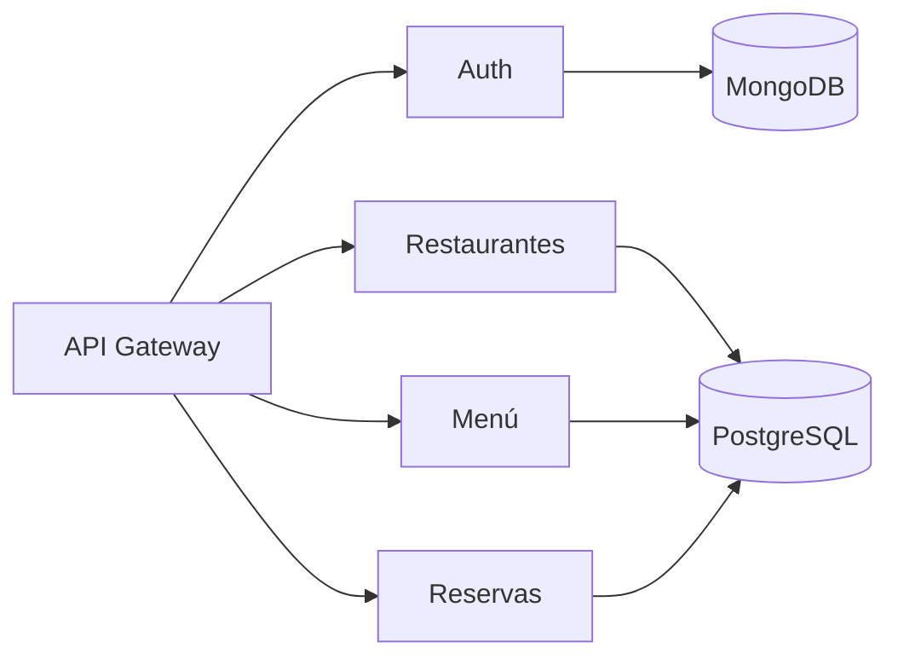

# Microservicios: Visión General

**Nota (Nov 2025)**: Cambios recientes: el init de BD (`scripts/init_db.py`) se hizo idempotente para evitar duplicados de restaurantes; además se añadió `scripts/cleanup_duplicates.py` para ayudar a consolidar duplicados existentes. Ejecutar backup antes de aplicar limpiezas. Más detalle en `docs/AUDITORIA.md`.

| Servicio | Puerto | Base de Datos | Propósito |
|----------|--------|---------------|-----------|
| Autenticación | 8004 | MongoDB | Gestión de usuarios y tokens JWT/refresh |
| Restaurantes | 8001 | PostgreSQL | CRUD de restaurantes |
| Menú | 8002 | PostgreSQL | CRUD de platos |
| Reservas | 8003 | PostgreSQL | Gestión de reservas y disponibilidad |
| API Gateway | 8000 | N/A | Enrutamiento y coordinación |
| Frontend | 5000 | N/A | Interfaz web (Flask) |

## Diagrama de Servicios

## Convenciones Comunes
- Health endpoint: `/health` en todos los servicios.
- Uso de `DATABASE_URL` para servicios SQL.
- Respuestas JSON normalizadas.

## Errores Comunes
| Código | Situación |
|--------|-----------|
| 400 | Validación de entrada fallida |
| 401 | Token inválido o ausente |
| 404 | Recurso no encontrado |
| 409 | Conflicto (disponibilidad / reserva duplicada) |
| 500 | Error interno o fallo de forward |

## Logging y Observabilidad (Pendiente)
- Enlazar request IDs en gateway y servicios.
- Añadir métricas Prometheus.
