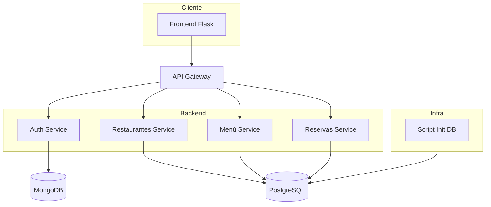
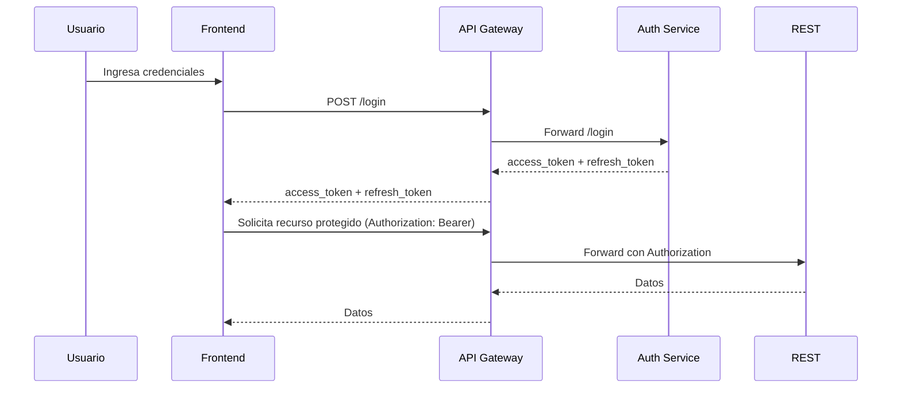
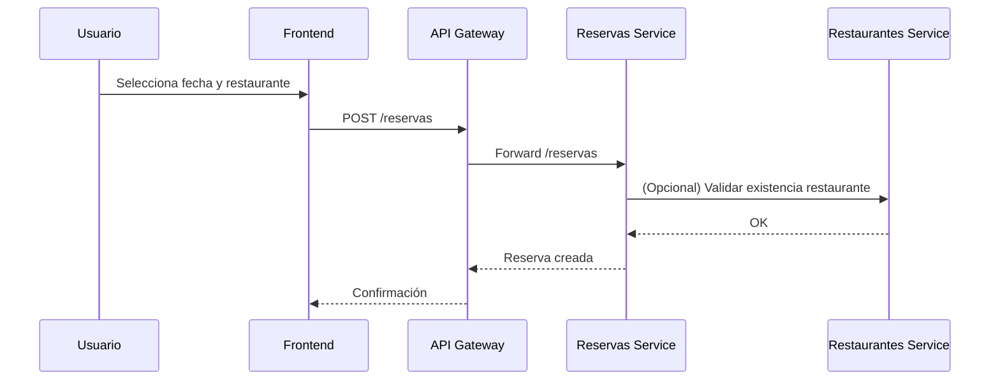

# Arquitectura del Sistema

Este documento describe la arquitectura de alto nivel del sistema de microservicios.

## Vista General

## Patrones
- Separación de responsabilidades por dominio.
- Comunicación HTTP síncrona vía API Gateway.
- Persistencia mixta (SQL relacional y NoSQL para usuarios/tokens).

## Decisiones Clave
| Decisión | Justificación |
|----------|---------------|
| Remover FKs en código entre servicios | Evitar acoplamiento de metadata entre microservicios y permitir evolución independiente |
| Rotación de refresh tokens | Mitigar riesgo de reutilización y facilitar revocación inmediata |
| Uso de MongoDB para Auth | Flexibilidad en almacenamiento de tokens y documentos de usuario |
| API Gateway simple con `requests` | Reducción de complejidad inicial, facilita extensión incremental |

## Flujo de Autenticación

## Flujo de Reserva

## Consideraciones de Escalabilidad
- Separar base de datos para cada servicio si crece la carga.
- Incorporar caché (Redis) para listas de restaurantes y menús.
- Rate limiting en API Gateway.

## Futuras Extensiones
- Websockets para disponibilidad en tiempo real.
- Motor de recomendaciones de menú.
