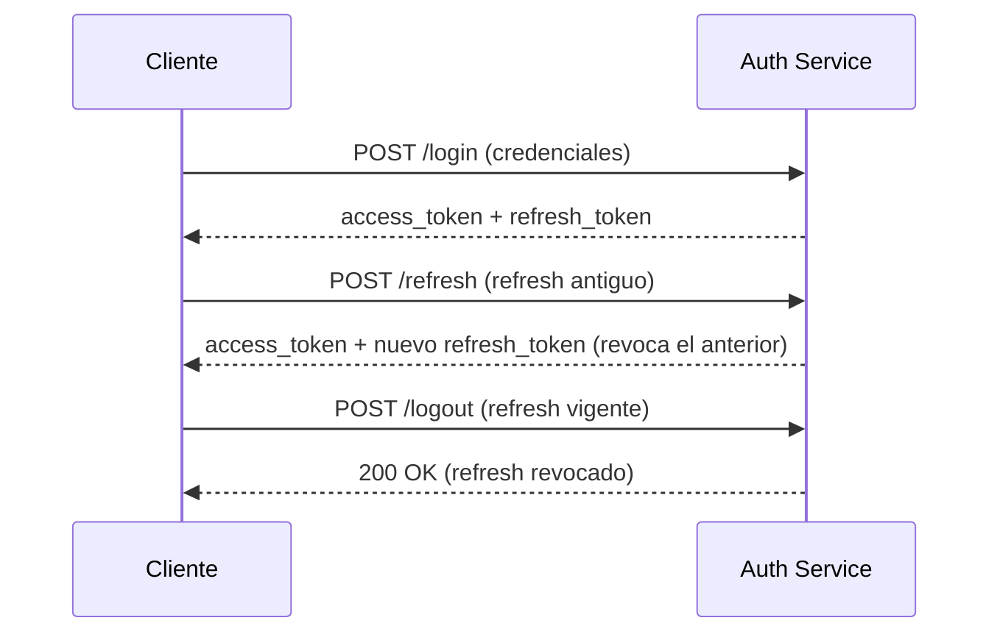

# Servicio de Autenticación

## Resumen
Gestiona usuarios, credenciales, emisión de access tokens (JWT) y refresh tokens con rotación.

## Endpoints
| Método | Ruta | Descripción |
|--------|------|-------------|
| POST | /register | Registrar nuevo usuario |
| POST | /login | Login (devuelve access y refresh) |
| POST | /refresh | Rotar refresh, emitir nuevo access + refresh si válido |
| POST | /logout | Revocar refresh token |
| GET | /me | Datos del usuario autenticado |
| GET | /health | Estado del servicio |

## Modelo de Usuario (MongoDB)
```json
{
  "email": "user@example.com",
  "password": "<hash>",
  "full_name": "Nombre Apellido",
  "role": "user | admin",
  "created_at": "2025-11-08T21:40:00Z"
}
```

## Flujo de Tokens


## Seguridad
- Hash PBKDF2-SHA256 (passlib).
- Expiración de access tokens: 60 min.
- Refresh tokens: 7 días, rotación forzada.
- Revocación: campo `revoked` en colección `refresh_tokens`.

## Mejoras Futuras
- Verificación de email.
- Roles avanzados y permisos por endpoint.
- Índice TTL para expiración automática de refresh tokens.
- Auditoría de inicios de sesión.
