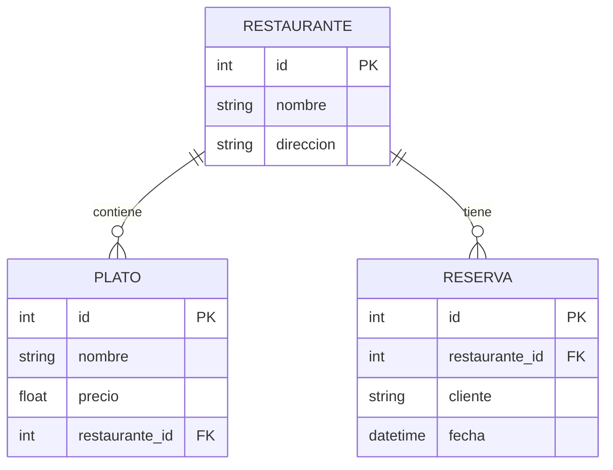

# Base de Datos

## Resumen
PostgreSQL central (actualmente compartida) y MongoDB para autenticación.

## Diagrama ER Simplificado

## MongoDB (Auth)
Colecciones:
- users
- refresh_tokens

## Inicialización
`/scripts/init_db.py` crea tablas y datos de prueba.
