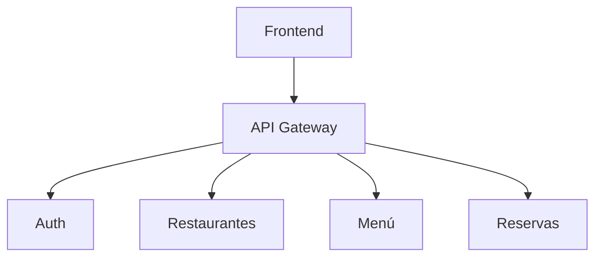

# API Gateway

## Funcionalidad
- Reenvío de métodos: GET, POST, PUT, PATCH, DELETE.
- Propagación de cabeceras, incluyendo Authorization.
- Timeout configurable mediante `GATEWAY_TIMEOUT` (por defecto 5s).

## Diagrama

## Mejoras Futuras
- Middleware de autenticación.
- Retries y circuito de ruptura.
- Logging estructurado.
