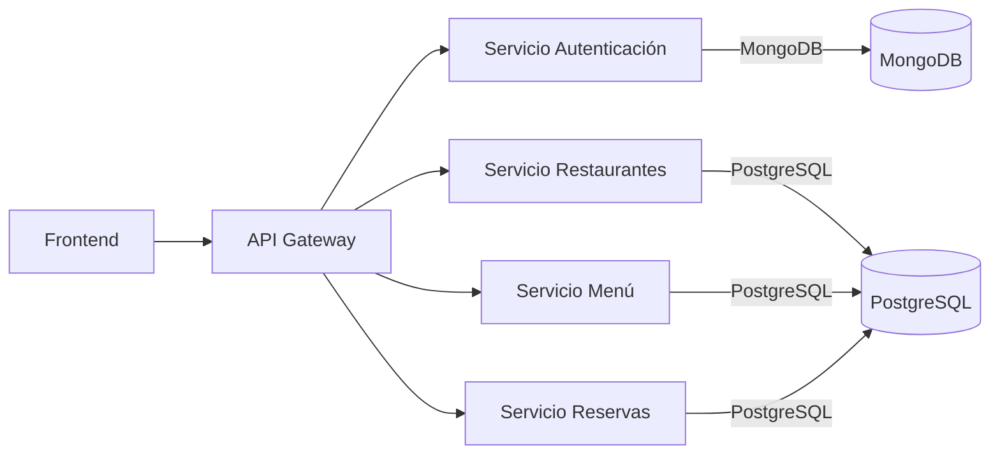

# Sistema de Reservas de Restaurantes

Bienvenido a la documentación oficial del sistema de microservicios para la gestión de restaurantes, menús y reservas.

## Objetivos
- Centralizar información técnica.
- Facilitar onboarding de nuevos desarrolladores.
- Definir claramente contratos de API y arquitectura.

## Vista Rápida de la Arquitectura

## Tecnologías Principales
- Python / FastAPI
- PostgreSQL & MongoDB
- Docker & Docker Compose
- JWT (Autenticación)
- MkDocs Material (Documentación)

## Estado Actual
Consultar la sección de Auditoría para progreso detallado.
