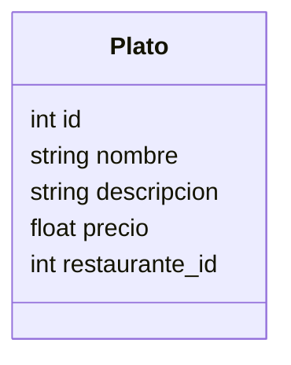

# Servicio de Menú

## Endpoints
- GET /platos/
- GET /platos/{id}
- POST /platos/
- PUT /platos/{id}
- DELETE /platos/{id}

## Modelo Plato

## Mejoras Futuras
- Menú del día.
- Filtros por categoría.
