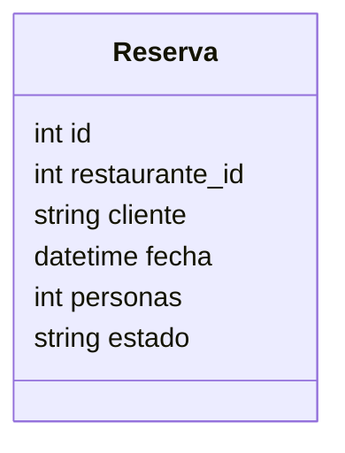

# Servicio de Reservas

## Endpoints
- GET /reservas/
- GET /reservas/{id}
- POST /reservas/
- PUT /reservas/{id}
- DELETE /reservas/{id}
- PUT /reservas/{id}/estado

## Reglas
- No se permiten fechas en el pasado.
- Validación de disponibilidad por franja horaria.

## Modelo Reserva

