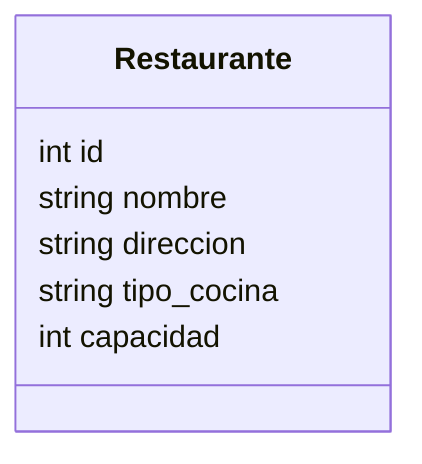

# Servicio de Restaurantes

## Endpoints Principales
- GET /restaurantes/
- GET /restaurantes/{id}
- POST /restaurantes/
- PUT /restaurantes/{id}
- DELETE /restaurantes/{id}

## Modelo SQL (resumen)

## Notas
- Validaciones básicas de datos.
- Docker expone el puerto 8001.
